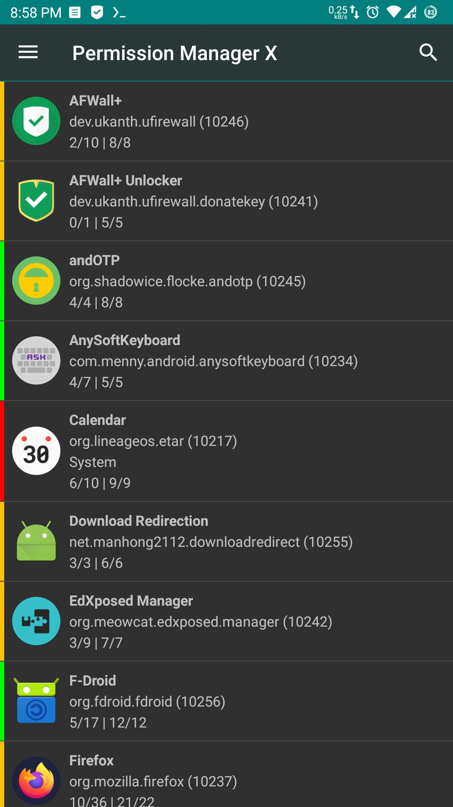
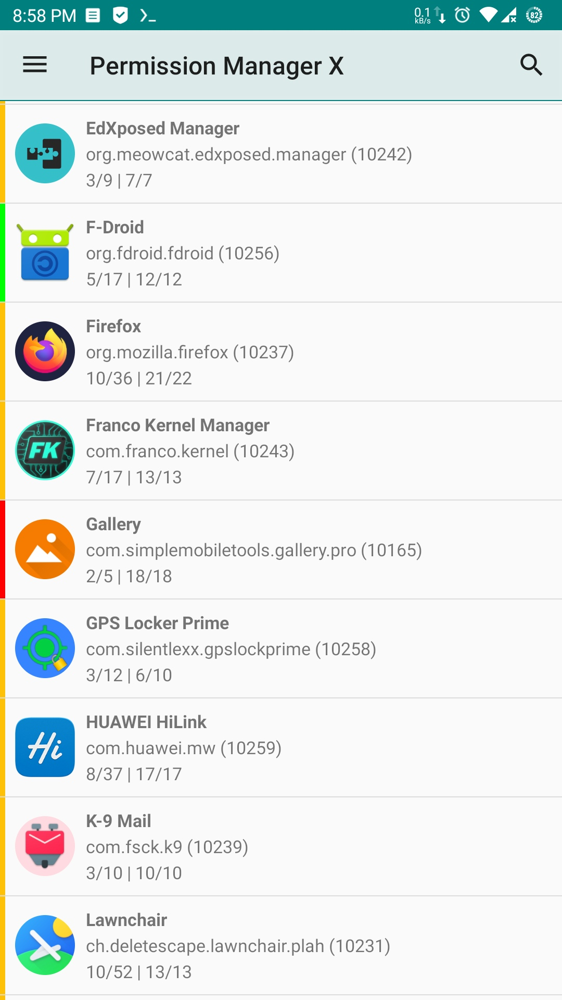
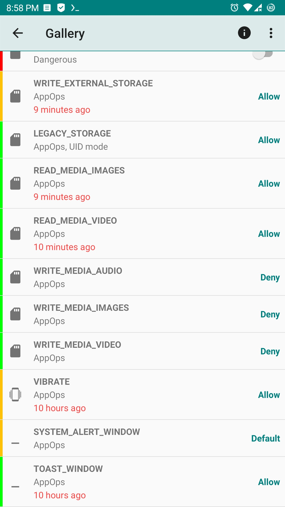
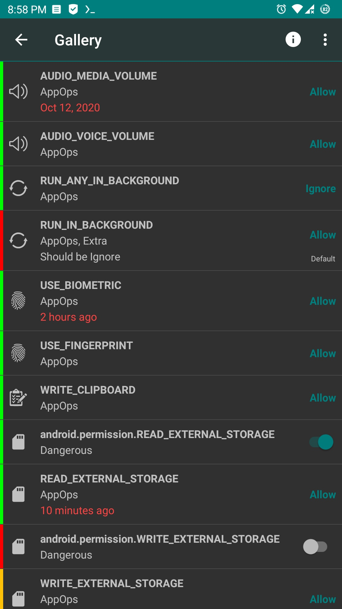
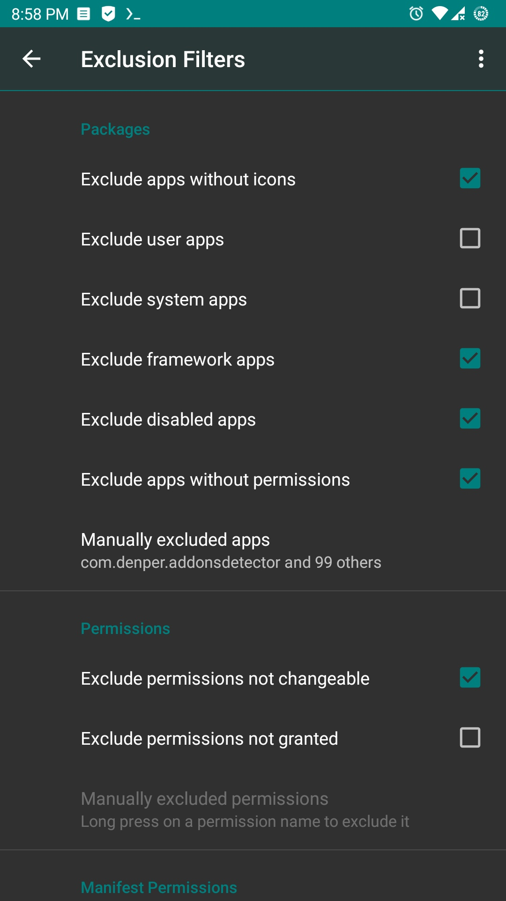
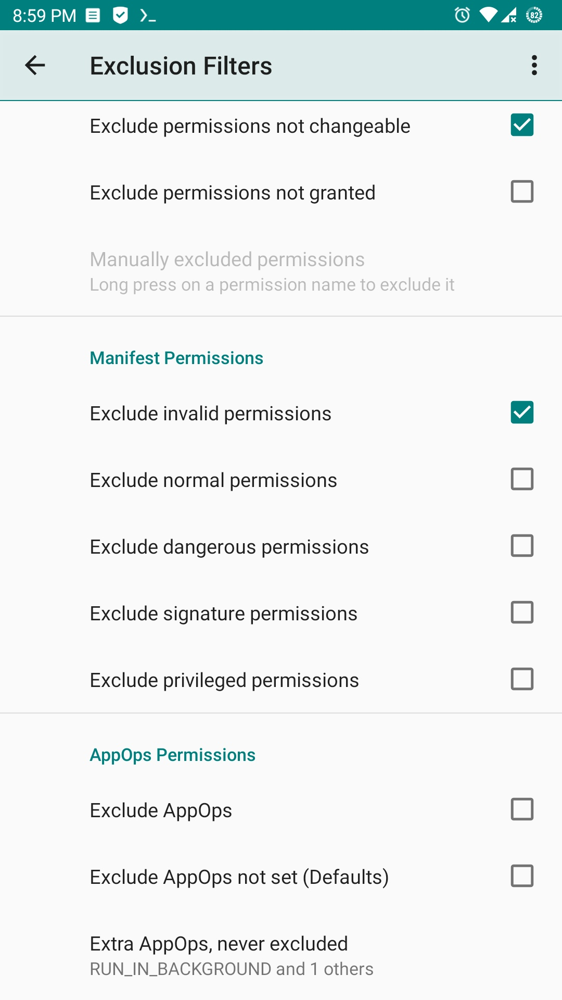

# PermissionManager X（FOSS 定制版）

e<b>X</b>tended <b>Permission Manager</b> for Android —— 在一个界面上查看并设置应用的 **Manifest 权限** 与 **AppOps**。

本仓库是 [mirfatif/PermissionManagerX](https://github.com/mirfatif/PermissionManagerX) 的 FOSS 定制分支，基于上游 `master`（v1.30，AGPL-3.0）修改，追加了 **权限视图**、**权限名中文映射**、**Shizuku ADB 权限** 三项功能，并补了 release 构建、签名与 CI。

> 上游官方的商店版本、帮助文档、付费版说明都指向上游仓库；本分支不发布到任何应用商店，产物只由 CI 构建，用于侧载。

## 功能

对每个已安装的应用，同一屏上可以：

* 查看、授予或撤销 Manifest 权限
* 查看 AppOps 权限，并在多个模式中选择
* 为每个可修改项设置自己的**参考状态**，便于批量审查与备份恢复

Manifest 权限就是通常所说的权限（存储、相机等）；AppOps（app operations）是 Android 在后端做访问控制的一套框架，随着 Android 版本迭代，Manifest 权限越来越依赖 AppOps。两者一起看、一起改，才能看清它们之间的关系。

换机、重刷 ROM、重装应用之后逐个复查权限很费时。PMX 的**参考状态**可以快速备份与恢复，列表左侧的彩色条让包与权限的状态一眼可见。

不清楚从哪看起？可以先读上游的中文帮助：

* [什么是 PMX？](https://mirfatif.github.io/PermissionManagerX/help/)
* [为什么需要 PMX？](https://mirfatif.github.io/PermissionManagerX/help/faqs/#faq36)
* [Manifest 权限与 AppOps 是什么？](https://mirfatif.github.io/IAnswers/android_appop_manifest_permissions)

## 相比上游的改动

### 1. 权限视图（Permission View）

上游把「按权限看应用」做成了付费功能；本分支在免费版基础上自行实现。

* 主界面菜单进入**权限视图**：列出当前所有权限（Manifest 权限与 AppOp），并显示使用它的应用数量。
* 点某个权限进入下一级，列出正在使用它的应用。
* 数据由 `PermViewParser` 从 `PackageParser` 的包列表聚合而来，因此用户在**排除过滤器**里配置的应用/权限规则在这里同样生效，两个界面看到的内容始终一致。
* 支持搜索（原始名与中文标签都能匹配）与下拉刷新。

### 2. 权限名中文化

* 新增 `PermNameMapper` 与词表资源 `app/src/main/res/values-zh-rCN/perm_names.xml`，把 `READ_CONTACTS` 这样的原始名显示为「读取联系人」。
* 查找顺序：整名精确匹配 → 去掉 `.permission.` 包名前缀 → 按 `_` 拆词后逐词拼装 → 回落原始名。只要有一个词查不到就整体回落，不会出现「读取 CONTACTS」这种半中半英的结果；未收录的 OEM 权限也照旧完整显示。
* **只影响显示**：`getName()`、数据库主键、备份 XML 里的属性仍然全部是原始名，所以备份文件与上游互通。
* `values/perm_names.xml` 是空数组，因此英文及其它语言的行为与改动前完全一致。

### 3. 用 Shizuku 获取 ADB 权限

* 上游的 ADB 档位要求无线调试配对，并依赖原生的 `libpmxe.so` 命令通道。本分支优先走 **Shizuku**：`ShizukuDaemon` + `PmxUserService`（AIDL 用户服务）负责拉起特权守护进程并转发 shell 命令，原生通道保留为回退。
* 权限档位顺序：Shizuku → （未偏好 root 时）无线调试 ADB → root → （偏好 root 时）无线调试 ADB。实际作答的那一档决定守护进程以什么身份启动。
* Shizuku 服务端有两种实现：Shizuku 管理器（`moe.shizuku.privileged.api`，通过 ADB 或 root 启动）和 Sui（KernelSU / Magisk 上的 root 模块）。两者都在时优先问管理器，管理端不应答才交给 Sui，每一步都有超时，不会把启动卡住。
* 需要 Shizuku 权限时弹出 Shizuku 自己的授权对话框（不用 `checkRemotePermission`，root 模式下它恒返回已授权，会跳过授权流程）。

### 4. release 构建的修复与保障

* **R8 裁剪修复**：Shizuku 按类名反射实例化 `PmxUserService` 并跨进程调用，R8 看不到这条链路，会把这个实现整个删掉（只留一个同名的空类），user service 从此起不来，绑定必然超时——表现为「无法获取 Shizuku 权限」，而权限其实已经授权。现在用 `@Keep` 加 `app/proguard-rules.pro` 里的 keep 规则保活，debug 不压缩所以只有 release 会中招。
* **绑定竞态修复**：Shizuku 按用户服务缓存 `ServiceConnection`，切走档位时不会清理，旧回调可能在新一次绑定期间到达并把已连上的服务判成坏掉；`ShizukuDaemon` 用 bind epoch 丢弃过期回调。
* **持续校验**：`tools/check_shizuku_user_service.py` 直接解析 APK 里的 DEX，确认用户服务与 AIDL `Stub` 仍在，CI 每次构建都会跑，避免这个坑被静默改回去。

## 使用前提

* 设备需要 **root**，或启用 **开发者选项 → 无线调试**（ADB over network），或安装 **Shizuku**（或 Sui）并授权本应用。
* `android.permission.INTERNET`：无线调试本身需要；对外的连接只用于检查更新与抓取帮助内容。
* 应用在原生 Android 7–17 上测试过，高度定制的 ROM 可能表现异常。

## 安装

从 [Actions](https://github.com/ycm50/appops/actions) 里下载最新一次构建的产物 `pmx-foss-apks`，包含：

| 文件 | 说明 |
| --- | --- |
| `app-debug.apk` | debug 版，包名带 `.debug` 后缀，与 release 可共存 |
| `app-release.apk` | release 版，已签名，可直接覆盖安装升级 |

**关于签名**：签名配置在 `app/build.gradle` 的 `signingConfigs.release`，用的是仓库内的 `keystore/pmx-release.p12`（PKCS12，别名 `pmx`，口令 `123456`）。密钥与口令都是公开的，作用仅仅是让后续版本能覆盖安装、不必先卸载；任何人都能签出同签名的包，所以它**不代表发布者身份，也不要拿它上架应用商店**。要换成私有密钥，把 keystore 换成从 secrets 解 base64 的做法即可。

## 从源码构建

### 环境要求

| 项目 | 版本 |
| --- | --- |
| JDK | 17 |
| Gradle | 9.0.0（仓库自带 wrapper，无需另装） |
| Android SDK | compileSdk / targetSdk 36，build-tools 36.0.0（minSdk 24） |
| Android NDK | 28.2.13676358（编译原生库必需） |
| 其它 | `git`、POSIX shell；`gperf`（libcap 生成 `cap_names.h` 时用，装了才走和上游一致的分支） |

`local.properties` 不入库，需要自己创建：

```properties
sdk.dir=/path/to/Android/Sdk
```

注意 `app/build.gradle` 的 `buildNative` 任务在**配置阶段**就会读它的 `sdk.dir` 并据此推导 NDK 目录，缺这个文件连 Gradle 配置都过不去。

### 步骤（Linux / macOS）

```bash
git clone --depth=1 --recurse-submodules --shallow-submodules https://github.com/ycm50/appops.git
cd appops
cp /path/to/local.properties .          # 或直接写入 sdk.dir
./gradlew :app:assembleRelease          # 或 :app:assembleDebug
```

产物在 `app/build/outputs/apk/{debug,release}/`。

原生库 `libpmxe.so` / `libpmxd.so`（4 个 ABI）由 `native/build_native.sh` 调用 NDK 里的 clang 编译，`native/libcap` 是必须递归拉取的 git submodule，`app/src/main/jniLibs` 是构建产物、不入库。

### Windows

`native/build_native.sh` 需要 POSIX shell 和子模块，Windows 上跑不了。在项目根目录放一个 `SKIP_NATIVE` 标记文件，`buildNative` 会变成 no-op，Java/Kotlin/资源编译照常：

```powershell
New-Item -ItemType File SKIP_NATIVE -Force
.\gradlew.bat :app:assembleDebug
```

这样编出来的 APK **没有原生库**，只能用来验证编译，不能用于运行期的守护进程握手；要出可用包请用 Linux（或 CI）。`SKIP_NATIVE` 已在 `.gitignore` 里，CI 会显式删除它。

### 依赖预取与离线构建

仓库里**不使用国内 Maven 镜像**：`settings.gradle.kts`、`buildSrc/settings.gradle.kts` 只声明官方原始仓库（`google()` / `mavenCentral()` / `gradlePluginPortal()` / `jitpack.io`）。国内网络的加速由依赖预取提供——把打好的包放进一个本地 Maven 仓库 `libs/maven-repo`，并让它排在仓库列表最前面：

```bash
./gradlew downloadDeps   # 解析依赖图 → 按原始仓库探活 → 多线程下载到 libs/maven-repo
./gradlew cleanDeps      # 怀疑文件下坏时清空缓存重来
```

* `downloadDeps` 只下载本地缺的文件，重复执行几乎不产生网络请求；下载走临时文件再 move，中断不会留下半个构件。
* `libs/maven-repo` 是纯 `file://` 仓库，因此预取完整后可以 `--offline` 构建；预取不完整也没关系，未命中的部分会回退到官方仓库联网解析。
* 该目录是本地缓存、体积不小，**不入库**；`git clone` 后跑一次 `downloadDeps` 即可重建。

如果本机需要代理：**不要**写进仓库里的 `gradle.properties`（`systemProp.*.proxyHost` 会让 CI runner 去连 `127.0.0.1`），放到用户级 `~/.gradle/gradle.properties`（Windows：`%USERPROFILE%\.gradle\gradle.properties`）：

```properties
systemProp.http.proxyHost=127.0.0.1
systemProp.http.proxyPort=10808
systemProp.https.proxyHost=127.0.0.1
systemProp.https.proxyPort=10808
systemProp.http.nonProxyHosts=localhost|127.0.0.1
```

### 常用 Gradle 任务

| 任务 | 作用 |
| --- | --- |
| `./gradlew :app:assembleDebug` | 编译 debug APK |
| `./gradlew :app:assembleRelease` | 编译已签名的 release APK |
| `./gradlew spotlessCheck` | 检查代码格式（已挂在 `preBuild` / 编译任务前面，编不过通常是格式问题） |
| `./gradlew spotlessApply` | 自动格式化 |
| `./gradlew downloadDeps` / `cleanDeps` | 预取 / 清空本地依赖仓库 |
| `./gradlew dependencyUpdates` | 检查依赖更新 |

代码格式由 Spotless 统一：Java 用 google-java-format 1.28.0，Kotlin 用 ktfmt 0.56。

## CI

`.github/workflows/build.yml` 在 GitHub 托管的 Ubuntu runner 上构建 debug 与 release，每一步都是这里踩过的坑，改动 workflow 时别踩回去：

1. 递归拉取 `native/libcap` 子模块，装 JDK 17、SDK 36、NDK 28.2.13676358 与 `gperf`；
2. 生成 `local.properties`（不入库，但配置阶段就要读）；
3. `rm -f SKIP_NATIVE`，**强制真正编译原生库**；
4. 先 `spotlessCheck`（让格式问题在日志里有清晰的失败点），再 `assembleDebug` + `assembleRelease`；
5. 校验 4 个 ABI 的 `libpmxe.so` / `libpmxd.so` 确实打进了 APK（jniLibs 是构建产物，不能指望仓库里有现成的）；
6. `apksigner verify` 校验 release 包确实已签名——避免签名配置失效却静默产出未签名包；
7. 跑 `tools/check_shizuku_user_service.py`，确认 release 里的 Shizuku 用户服务没被 R8 裁掉；
8. 写构建摘要并上传产物 `pmx-foss-apks`（保留 14 天）。

CI **不跑** `downloadDeps`：预取是为国内网络准备的本地缓存，海外 runner 直接走官方仓库联网解析，跑一遍只是白白多花几分钟。

## 目录结构

```
app/                 应用模块（Java 源码、资源、AIDL、proguard 规则）
priv_library/        权限操作库（应用侧）
priv_daemon/         特权守护进程
hidden_apis/         隐藏 API 桩
native/              原生辅助程序（pmxe / pmxd + libcap 子模块）
buildSrc/            Gradle 约定插件与依赖预取实现（DepsPrefetch.kt）
tools/               CI 校验脚本（Shizuku 用户服务是否被 R8 裁剪）
help/                内置的离线帮助文档（多语言）
fastlane/            商店元数据与截图
keystore/            release 侧载签名（公开密钥，见「安装」一节）
```

## 已知问题

* Shizuku 模式下，如果应用进程被系统杀掉并由系统自动重启（例如修改 PMX 自身的运行时权限后 Android 会杀掉该进程），应用与仍然存活的守护进程之间缺少重新握手的路径：`NativeDaemon.isAlive()` 在 Shizuku 模式恒返回 true，`connectToCheckAlive()` 直接返回，`DaemonHandler.connectToDaemon()` 的重连又依赖 TCP 端口（Shizuku 路径没有端口），而 `CODE_WORD` 是每个进程重新生成的随机 UUID。结果是写操作被静默跳过、界面却已乐观更新——**界面显示已修改，系统实际未变**。需要补一个等价于原生 `CMD_CODE_WORD` 的重新握手机制。
* 高度定制的 ROM 上行为可能与原生 Android 不同。

## 隐私

对外连接只用于检查更新与抓取帮助内容。隐私政策见 [上游隐私政策](https://mirfatif.github.io/PermissionManagerX/privacy_policy.html)，仓库内也保留了一份 [privacy_policy.html](privacy_policy.html)。

## 许可与署名

本分支沿用上游许可：**AGPL-3.0**，改动部分同样以 AGPL-3.0 发布。上游版权归 mirfatif 及贡献者所有。

> You **CANNOT** use and distribute the app icon in anyway, except for **Permission Manager X**（`com.mirfatif.permissionmanagerx`）app.

```
Permission Manager X is free software: you can redistribute it and/or modify
it under the terms of the Affero GNU General Public License as published by
the Free Software Foundation, either version 3 of the License, or
(at your option) any later version.

This program is distributed in the hope that it will be useful,
but WITHOUT ANY WARRANTY; without even the implied warranty of
MERCHANTABILITY or FITNESS FOR A PARTICULAR PURPOSE.  See the
Affero GNU General Public License for more details.

You should have received a copy of the Affero GNU General Public License
along with this program.  If not, see <https://www.gnu.org/licenses/>.
```

### 上游与第三方

* [mirfatif/PermissionManagerX](https://github.com/mirfatif/PermissionManagerX) —— 上游项目、[帮助文档与 FAQ](https://mirfatif.github.io/PermissionManagerX/help/)、[Telegram 支持群](https://t.me/PermissionManagerX)、[XDA 主题帖](https://forum.xda-developers.com/t/app-7-0-permission-manager-x-manage-appops-and-manifest-permissions.4187657)
* [Shizuku](https://github.com/RikkaApps/Shizuku) / [Sui](https://github.com/RikkaApps/Sui) —— ADB / root 级别的特权通道
* [Android Jetpack](https://github.com/androidx/androidx)、[Android Hidden APIs](https://github.com/anggrayudi/android-hidden-api)、[LSPass](https://github.com/LSPosed/AndroidHiddenApiBypass)、[LibADB Android](https://github.com/MuntashirAkon/libadb-android)、[Spotless GoogleJavaFormat](https://github.com/diffplug/spotless)、[Material Components for Android](https://github.com/material-components/material-components-android)、[Guava](https://github.com/google/guava)、[BetterLinkMovementMethod](https://github.com/saket/Better-Link-Movement-Method)、[LeakCanary](https://github.com/square/leakcanary)、[gradle-download-task](https://github.com/michel-kraemer/gradle-download-task)

## 截图

  
  
